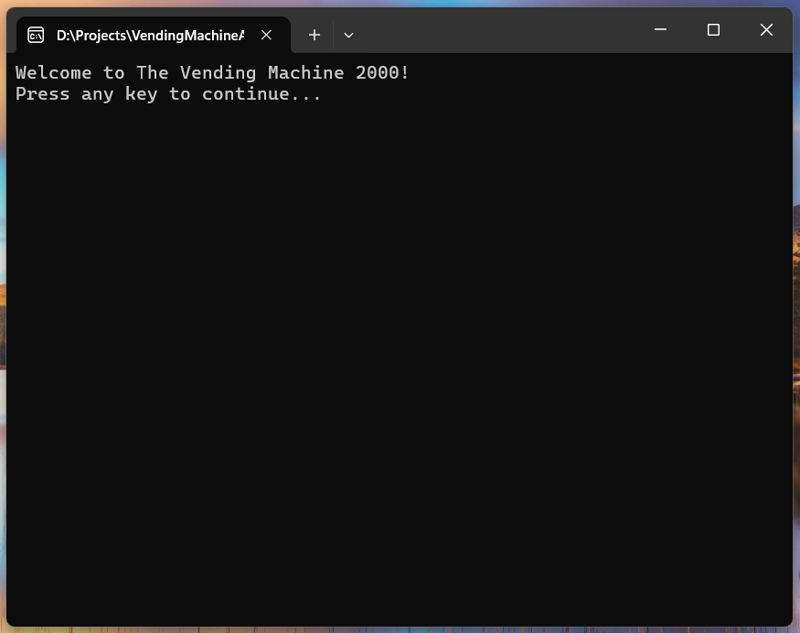
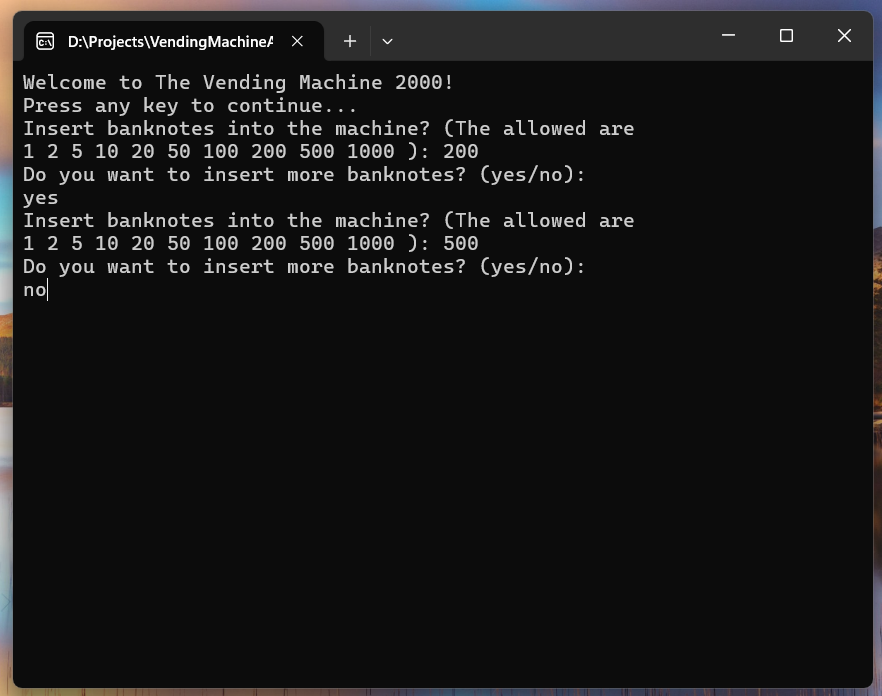
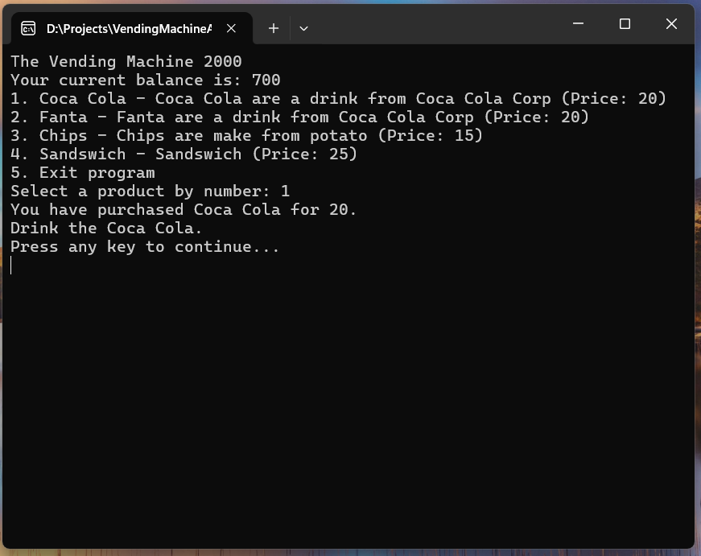
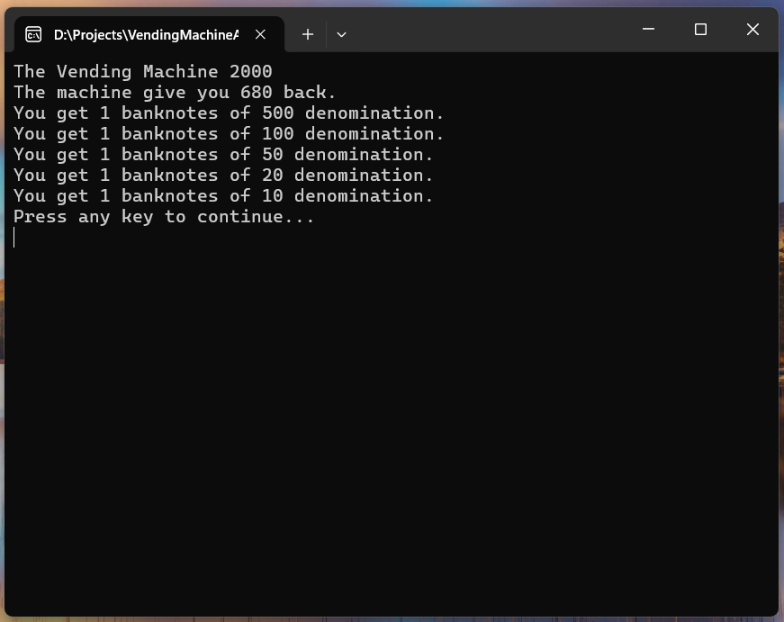

# Vending Machine

A simple vending machine simulation as a console application in C#. This project demonstrates basic object-oriented programming concepts, including classes, inheritance, and polymorphism.

## Technologies Used

- C# 
- .Net 8
- Console Application
- Object-Oriented Programming
- Inheritance
- Polymorphism
- Abstract Classes

## Using the Vending Machine

1. Download the executable from the releases section of the repository.
2. When the application lanuches, it should look like this:

3. Insert moeney by selecting the amount you want to insert:

4. Select a product by entering the corresponding number:

5. Show what the machine give back to user when user choice to exit.

## Upcoming Features

- Add a user interface for better interaction
- Implement a database to store products and transactions
